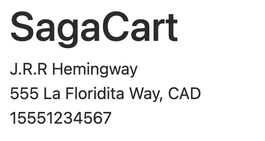
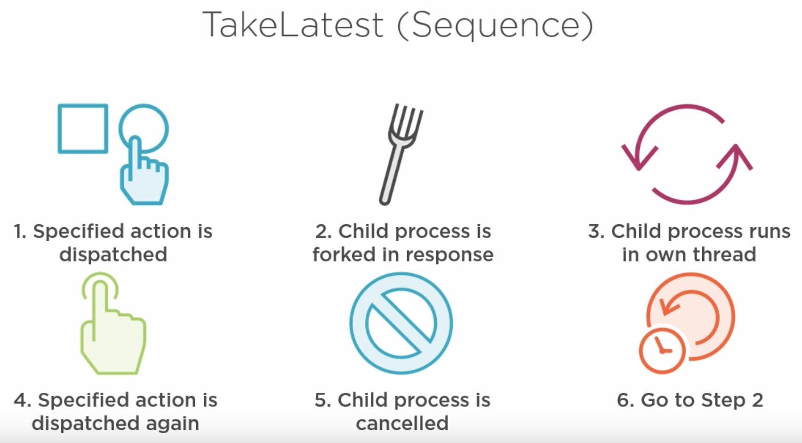
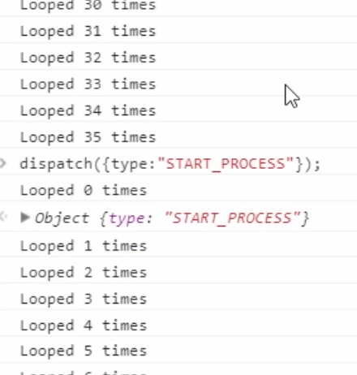
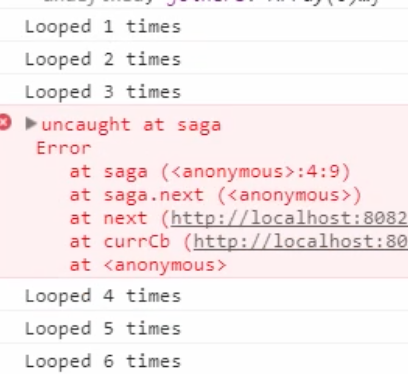

https://coursehunter.net/course/redux-saga

# Introduction

## 13. Setting up the application

https://github.com/danielstern/redux-saga-shopping-cart-server

`npm i && npm start`

frontedn app: https://github.com/danielstern/redux-saga-cart/tree/begin

## 14. Installing and configurening redux-saga

We can have several saga middleware in different parts of our application

## 15. Creating your first saga

Resume saga execution after delay

```
import {delay} from "redux-saga";
yield delay(1000);
```

# Asynchrous ES6 and yield

## 18. What is yield?

Code meant to be run afte API call resolves must be placed inside callback.

Code outside callback runs out-of order
Wihout yield:

```
api.call(myURL, function callback(data)) {
	// code execution resumes here
}
// code outside callback runs before callback resolution
```

With yield:

```
let data = yield api.call(myURL);
// execution resumes here. No code run before promise resolution
```

```
var generator = function* (){return 5}
generator().next() // {value: 5, done: true}
```

```
var generator = function* () {
	yield 1;
	yield 2;
	yield 3;
	yield 4;
	return 5;
}

var obj = generator();
obj.next(); // {value: 1, done: false);
obj.next(); // {value: 2, done: false);
obj.next(); // {value: 3, done: false);
obj.next(); // {value: 4, done: false);
obj.next(); // {value: 5, done: true);
obj.next(); // {value: undefined, done: true);
```

Here first value returned by generator (promise) has to be resolved and only after that we'll get the next value

```
var delayGenerator = function* () {
	yield new Promise(r => setTimeout(r, 1000))
	return 42;
}

var obj = delayGenerator()
obj.next().value.then(v => {
	console.log(obj.next())
})
```

## 22. Yield and promises

- code execution resumes when promise is resolved
- if primise throws an error, code stops at yield line and doesnt throw and error

## 23. Wrapping generators

- Yielded promise must still be called manually by some code
- redux saga wraps generators automatically
- Co.js can wrap generators outside of redux-saga app

Without wrapper:

```
function* getData() {
	let data = yield api.call('/cart');
	return data + 5;
}
// wrapper code still needs .then somewhere to capture the response from API and pass it to generator

let gen = getData();
let promise = gen.next();
promise.then(data => {
	let value = get.next(data);
})
```

Sagas are wrapped by redux saga, `.then` is never manually called

```
function* mySaga() {
	yield delay(500);
	yield delay(700);
	console.log('Saga complete');
}
```

## 24. Wrapping generators with redux saga and Co

Run generator with redux saga
Note that promises are resolved automatically
Second argument in `delay` is returned from promise

```
var delayGenerator = function* () {
	let data1 = yield delay(1000, 1);
	console.info("Step 1");
	let data2 = yield delay(2000, 2);
	console.info("Step 2");
	let data3 = yield delay(3000, 3);
	console.info("Step 3");
	return data1 + data2+ data3;
}

var obj = delayGenerator();
// call next() manually, without waiting for promise resolve:

obj.next() // Object(value: Promise, done: false);
Step 1
obj.next() // Object(value: Promise, done: false);
Step 2
obj.next() // Object(value: Promise, done: false);
Step 3
obj.next() // Object(value: NaN, done: true);
```

`NaN` because we didn't wait for promise to be resolved

Using saga's `run` we'll see console logs, since generator is executing, but we don't see the returned values from `next()`

```
run(delayGenerator);
Object{@@redux-saga/TASK: true, ...}
Step 1
Step 2
Step 3
```

Co works differently

# Redux saga effects

## 27. Introduction to effects

- Thread management
  call
  fork
  spawn
  apply
  cancel
- Action creation
  put
- Data seeding
  select
- Flow control
  take
  takeEvery
  takeLates

## 28. Take

Code pauses when it gets to `take`
Use `take` to verify action is dispatched

```
let mySaga = function* () {
	console.info("Saga begins");
	const state = yield effects.take("SET_STATE");
	console.info("Got state...", state);
}

run(mySaga)
// Saga begins
// Object{@@redux-saga/TASK: true, ...}

dispatch({type: "SET_STATE", value: 42})
// Got state... Object{type: "SET_STATE", value: 42}
// Object {type: "SET_STATE", values: 42}
```

## 29. Put

Dispatches action to the rest of the app

```
let mySaga = function* () {
	console.info("Saga begins");
	const state = yield effects.take("SET_STATE");
	console.info("Got state...", state);
}

run(mySaga)
// Saga begins
// Object{@@redux-saga/TASK: true, ...}

let putSaga = function* () {
	yield effects.put({type: "SET_STATE", value: 42})
}

run(putSaga)
// Got state... Object{type: "SET_STATE", value: 42, @@redux-saga/SAGA_ACTION: true}
//
```

## 30. Call

Calls a method
Related to testing

## 31. Implementing Take, Call and Put in the application

- _currentUserSaga_ waits for -`GET_CURRENT_USER_INFO` action with `take`
- Current user information only ever needs to be fetched once
- Update current user status saga to call Redux Cart Server API
- Use saga to _put_ action containing returned information to the app
- Trigger reducers and update display components

_currentUserSaga.js_

```javascript
export function* currentUserSaga() {
  const { id } = yield take(GET_CURRENT_USER_INFO);
  const response = yield call(fetch, `http://localhost:8081/user/${id}`);
  const data = yield apply(response, response.json);
  yield put(setCurrentUser(data));
}
```



## 32. Fork

- invokes the specified method (like call)
- can't acces yielded variables
- caller continues without pausing execution
- if parent process errors or is canlcelled all forked processes are cancelled
- _finally_ block of forked method is invoked during cancellation

## 33. Implementing fork in the application

- Create _fetch cart saga_ which gets list of item IDs in teh user's cart
- Create separate _item details saga_ which forks a proccess for each item ID and requests and fetches those details

_itemDetailsSaga.js_

```javascript
import { fork, put, take } from "@redux-saga/core/effects";
import fetch from "isomorphic-fetch";

import { setItemDetails, SET_CART_ITEMS } from "../actions";

export function* loadItemDetails(item) {
  const { id } = item;
  const response = yield fetch(`http://localhost:8081/items/${id}`);
  const data = yield response.json();
  const info = data[0];
  yield put(setItemDetails(info));
}

export function* itemDetailsSaga() {
  const { items } = yield take(SET_CART_ITEMS);

  yield items.map((item) => {
    console.log(" --- ITEM 0 --- ", item);
    return fork(loadItemDetails, item);
  });
}
```

## 34. Takeevery

## 35. Cancel and cancelled

- stops a forked process
- stopped process will be cut off at most recent yield
- _finally_ is invoked in forked process

_Cancelled_

- method that retruns _true_ if callee process has been cancelled by caller
- used in _finally_ block if cancelleation (not error) is the reason of termination

```javascript
let process = function* () {
  try {
    console.log("Process looped");
    yield delay(500);
  } finally {
    const cancelled = yield cancelled();
    console.log("Cancelled", cancelled);
  }
};

let saga = function* () {
  let forked = yield fork(process);
  yield delay(5000);
  yield cancel(forked);
  console.log("Done");
};
```

## 36. Takelatest

- combination of _fork_, _takeEvery_ and _cancel_



example:

```javascript
let process = function* () {
  let timesLooped = 0;
  while (true) {
    console.info(`Looped ${timesLooped++} times`);
    yield delay(500);
  }
};

let saga = function* () {
  yield takeLatest("START_PROCESS", process);
};

run(saga);

dispatch({ type: "START_PROCESS" });
```



_itemQuantitySaga.js_

```javascript
import { takeLatest } from "@redux-saga/core/effects";
import {
  decreaseItemQuantity,
  DECREASE_ITEM_QUANTITY,
  FETCHED,
  FETCHING,
  INCREASE_ITEM_QUANTITY,
  setItemQuantityFetchStatus,
} from "../actions";
import { currentUserSelector } from "../selectors";

export function* handleDecreaseItemQuantity({ id }) {
  yield put(setItemQuantityFetchStatus(FETCHING));
  const user = yield select(currentUserSelector);
  const response = yield call(
    fetch,
    `http://localhost:8081/cart/remove/${user.get("id")}/${id}}`
  );
  console.info("Get response", response);

  if (response.status !== 200) {
    yield put(decreaseItemQuantity(id, true));
    alert(
      "Sorry, there weren't enought items in stock to complete your request"
    );
  }

  yield put(setItemQuantityFetchStatus(FETCHED));
}

export function* handleIncreaseItemQuantity({ id }) {
  yield put(setItemQuantityFetchStatus(FETCHING));
  const user = yield select(currentUserSelector);
  const response = yield call(
    fetch,
    `http://localhost:8081/cart/add/${user.get("id")}/${id}}`
  );
  console.info("Get response", response);

  if (response.status !== 200) {
    yield put(decreaseItemQuantity(id, true));
    alert("Received non 200 status");
  }

  yield put(setItemQuantityFetchStatus(FETCHED));
}

export function* itemQuantitySaga() {
  yield [
    takeLatest(DECREASE_ITEM_QUANTITY, handleDecreaseItemQuantity),
    takeLatest(INCREASE_ITEM_QUANTITY, handleIncreaseItemQuantity),
  ];
}
```

## 38. Spawn

```javascript
let process = function* () {
  let timesLooped = 0;
  while (true) {
    console.info(`Looped ${timesLooped++} times`);
    yield delay(500);
  }
};

let saga = function* () {
  yield spawn(process);
  yield delay(1000);
};

saga = function* () {
  yield spawn(process);
  yield delay(1000);
  throw new Error();
};
```



not falling when parent process throws an error (fork stops);

## 39. All

- compbines nubmerous _take_ statements into one
- code execution resumes when all actions have been dispatched (in any order);

## 41. Channels

- Action channels
- Generic channels
- Event channels

## 42. What are channels

**Action channels**
Buffer

**Event channel**
Consume outside sources

**Channel**
Communicate between between two sagas

## 43. Action channels

Recoreds all events with specified type

calling _take_ accesses and removes oldest record

Used to handle actions that would otherwise be lost

Demo:
Create an action channel and a saga that consumes events at a set pace

Dispatch trigger event rapidly

Note how saga is triggered the correct amount of times

```javascript
function* updateSaga() {
  let chan = yield actionChannel("UPDATE");
  while (true) {
    yield take(chan);
    console.info("Update logged);
    yield delay(1000);
  }
}
```

every dispatch is processed:


Without saga dispatch processed once:

```javascript
function* updateSaga() {
  let chan = yield actionChannel("UPDATE");
  while (true) {
    yield take(chan);
    console.info("Update logged);
    yield delay(1000);
  }
}
```


